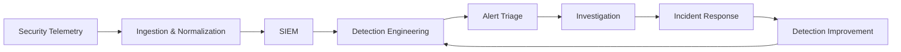

<div align="center">

# Hi, I'm Luís Barros 👋

### Cybersecurity Consultant | SIEM & Detection Engineering | SOC Operations

I build detection content, security data pipelines and automated workflows that help security teams find meaningful threats within large volumes of data.

[](https://luisantoniio1998.github.io/)
[](https://www.linkedin.com/in/-luis-barros-/)
[](https://profile.hackthebox.com/profile/019c3260-837c-701e-8430-ed2712df52a7)
[](https://tryhackme.com/p/lb.)
[](mailto:luisantoniio1998@gmail.com)

</div>

---

## `whoami`

```text
> location      Switzerland
> role          Cybersecurity Consultant
> focus         SIEM | Detection Engineering | SOC Operations
> platforms     Splunk | Microsoft Sentinel | Elastic
> languages     Portuguese | English | French
> mindset       Detect. Investigate. Automate. Improve.
```

I am a cybersecurity professional focused on building practical and scalable defensive-security capabilities.

My work includes engineering high-volume security-log pipelines, developing MITRE ATT&CK-aligned detections, investigating suspicious activity and automating security operations with Python.

I enjoy turning raw telemetry into useful security signals — and useful signals into actionable detections.

---

## 🛡️ Cybersecurity Focus



- SIEM architecture and administration
- Detection engineering
- Security-log ingestion and normalization
- SOC monitoring and alert triage
- Threat hunting
- Incident investigation and response
- Network-security monitoring
- Security-process automation
- Detection tuning and false-positive reduction

---

## ⚙️ Security Stack

### SIEM & Detection


### Query Languages & Automation


### Log Engineering & Monitoring


### Network & Endpoint Security


![Check Point](https://img.shields.io/badge/Check_Point-EA1D76?style=flat-square
